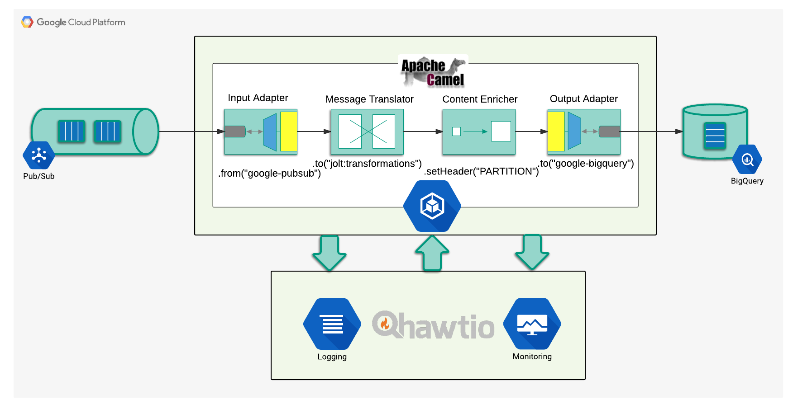
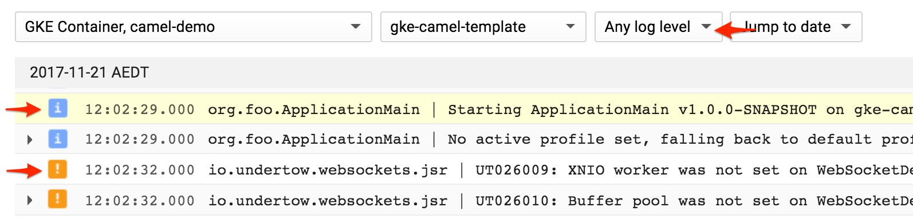
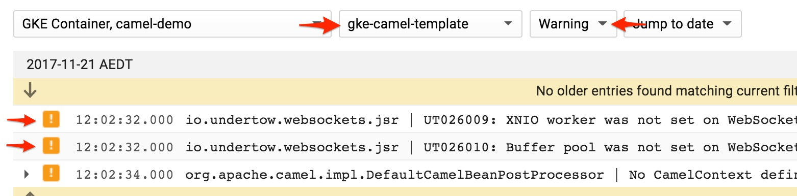
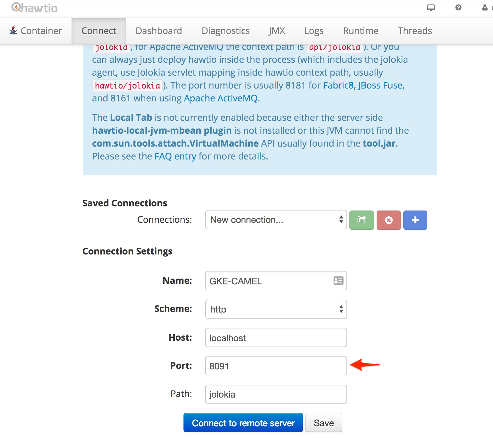
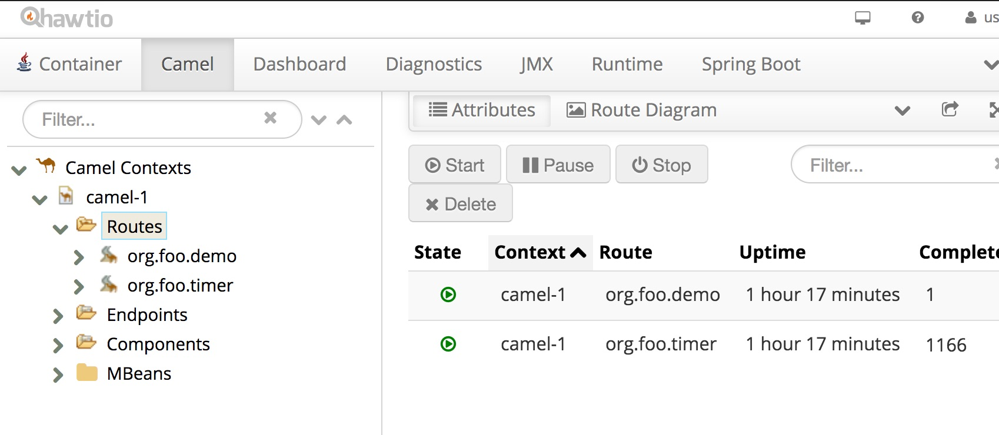

# Apache Camel in Google Kubernetes Engine

A practical template on how to deploy [Apache Camel](http://camel.apache.org/) solution on [Google Kubernetes Engine](https://cloud.google.com/kubernetes-engine/).

* [Toolstack required](reference/02_toolstack_required.md)
* [Google Cloud Project setup](reference/03_gcp_setup.md)
* [Build and Deploy](reference/04_build_deploy.md)

### Overview

The presented blueprint is a [widely recognised Camel / Springboot combination](https://egkatzioura.com/2017/11/20/spring-boot-and-apache-camel/) that implements a simple integration scenario:



- Camel consumes a message from Google PubSub subscription
- Transforms the data
- Updates the header to define the Bigquery table partition 
- Writes to the Bigquery table

Every exchange is logged at Google Stackdriver Logging and operational metrics collected by Google Stackdriver Monitoring - from both JVM and Camel.

The solution is packaged into a Docker image, which is uploaded to the GCP Container Registry and deployed to the GCP Kubernetes Engine - refer to the [Build and Deploy](reference/04_build_deploy.md) section for the details 

This walkthrough covers:

- [Parameters](#parameters)
- [Logging](#logging)
- [Metric collection and monitoring](#metric-collection-and-monitoring)
- [Hawtio Console](#hawtio)

### Parameters

Out of the box Kubernetes provides two delivery mechanisms for the configuration values into the container. So once a configuration map or a secret (externalised configuraiton options in Kuberenets) have been defined within the cluster, their values can be made available to the applications either as files or as environmental variables. 

The demo relies on [Springboot Externalised Configuration options](https://docs.spring.io/spring-boot/docs/current/reference/html/boot-features-external-config.html) to ingest both types and that gives the flexibility to override them at any stage of CI/CD lifecycle.

The blueprint assumes that there are four places where a SpringBoot property can be configured:

1. Springboot `application.properties`. Values defined here can not be overridden. Generally used for Springboot configuration and hard, unchangeable standards.
2. Custom `default.properties`. That's where usually the application specific defaults are defined by a developer.
3. Optional file pointed by the `${external.config}` java property. The file is generally intended to be used by system administrators that would opt to use an external file instead of the environmental variables. 
4. Environment variables defined through a Docker image or Kubernetes cluster, captured and converted into Java and Camel properties by Springboot.

**Please note** - the relationship between the last three is important. 

Options 2 and 3 are explicitly configured in the `ApplicationMain.java`:

```java
@SpringBootApplication
@PropertySources({
        @PropertySource("classpath:default.properties"),
        @PropertySource(value = "${external.config}", ignoreResourceNotFound = true)
})
public class ApplicationMain {
```

 and the their lisitng order defines the preference:

- Properties defined in the `default.properties`  (option no 2) - will be **overriden** by the values defined in the external file - `${external.config}` (option 3) - if the same key is defined in both.
- Values defined through environmental variables - Option 4 - **supercede** the values from the both property files.

This way the developer has an option of falling back onto some well defined defaults, or to provide their own configurations as well as allowing the administrator to override any of these through an external config file or the environmental variables defined in the Kubernetes deployment config.

This flexibility, though rarely required, came quite useful in a few less than usual situations.

### Logging

On the surface logging looks super easy - Kubernetes Engine sends the container standard output stream to Stackdriver Logging automatically. No configuration required. Simple!

There is, however, a couple of gotchas. The first one - every line collected becomes a separate log entry. What's wrong with that? Well, java exceptions are usually multiline stack traces - reading those across multiple log entries can be a bit confusing.

The other interesting point is that these entries would be logged as INFO. Google Kubernetes logging agent - FluentD - does not know how to parse them to get the severity right. There is a number of different formats out there, so one size fits all automatic solution is indeed a hard problem.

However the application CAN provide the output in the format that FluentD can understand. The format is defined in  `logback.xml` - a JSON string where the field names configured as FluentD parser requires. And thanks to the [Elastic.co](https://www.elastic.co/products/logstash) team there is also an awesome Logstash component that encolses a multilne stack trace into a single entry!

```xml
<!-- To be able to manage the log levels through Hawtio console -->
<jmxConfigurator/>

<!-- Enclosing stacktrace into a single log entry -->
<conversionRule conversionWord="stack" 
converterClass="net.logstash.logback.stacktrace.ShortenedThrowableConverter"/>

<!-- Formatting the output as a JSON string, parseable by FluentD -->
<appender name="STDOUT" class="ch.qos.logback.core.ConsoleAppender">
  <encoder class="net.logstash.logback.encoder.LoggingEventCompositeJsonEncoder">
    <providers>
       <mdc/>
       <pattern>
          <pattern>
          <!-- timestamp is collected automatically by fluentd -->  
          { "severity": "%level", "message" : "%logger | %message%stack{30,30,2048,rootFirst}" }
          </pattern>
       </pattern>
    </providers>
  </encoder>
</appender>
```

Checking output:

```bash
kubectl logs -f deploy/gke-camel-template
```

```json
{"severity":"INFO","message":"org.foo.ApplicationMain | Starting ApplicationMain v1.0.0-SNAPSHOT on gke-camel-template-7b4bd9ccdb-dns4l with PID 1 (/u00/lib/gke-camel-template-1.0.0-SNAPSHOT.jar started by root in /u00)"}
```

Severity has been parsed correctly. Let's check the [Stackdriver Logging UI](https://console.cloud.google.com/logs/viewer):



That allows for a nice and easy filtering, which also works in the streaming mode, where the log entries are displayed as they come in the [real] time:



Notice how the exception is trimmed down to a single entry:


Another interesting point is that Google Stackdriver Logging also permits log based metric colelction, having the sevirity available as a selection condition makes the process much faster.

Now lets have a look inside the running container.

### Metric Collection and Monitoring

Quoting Lord Kelvin:

> If you can not measure it, you can not improve it. 

Leaving aside the philisophical contention around the essence of the expression, I hope that there is a general agreement that tracking the application performance metrics is of paramount importance. 

There have been two general approaches around capturing the metrics from a containerised application - either an external collection crawler (a sidecar container, node service, etc) or the application itself reporting in.

The option presented here can be considered to be the middleway between the two.

Even though it is the "reporting in" pattern, it is implemented by the underlying JVM and not by the application itself. 

The blueprint includes [Jmxtrans Agent](https://github.com/jmxtrans/jmxtrans-agent) - a java agent that periodically inspects the running application through JMX and reports the metrics to the collection point through a specific writer. Goggle Cloud Platform is supported by [Google Stackdriver Writer](https://github.com/jmxtrans/jmxtrans-agent/tree/master/src/main/java/org/jmxtrans/agent/google) - the component responsible for writing to [Google Stackdriver Metrics API](https://cloud.google.com/monitoring/docs/).

The java agent is completely dependency free, and while it is loaded before the application it will not interfere with the app libraries. It is a generic java agent - can be used with any JVM based application as far one supports JMX.

While for the presentation purposes the metrics collector and the config file are included within the project itself, the preferred way would be to bake these into the base Docker image.

This way, while a reasonable default configuration is provided for collecting JVM and Apache Camel metrics it still can be superseded by a a different config file if a bit more granular introspection is required by the developer or the admin.

Dockerfile example:

```dockerfile
ENTRYPOINT exec java -cp "/u00/lib/*" \
                     -javaagent:/u00/jmxtrans-agent.jar=classpath:metrics.xml \
                     org.foo.ApplicationMain
```

And a couple of examples from the metrics.xml:

```xml
<!-- Single JVM metric -->
<query objectName="java.lang:type=Memory" attribute="HeapMemoryUsage" key="used"  type="GAUGE:By" resultAlias="jvm.memory.HeapMemoryUsage:used"/>

<!-- Single Apache Camel metric -->
<query objectName="org.apache.camel:context=*,type=routes,name=*" attribute="ExchangesCompleted" type="CUMULATIVE:1" resultAlias="camel.route.exchanges:%name%:#attribute#"/>
```

The Camel metric declaration above is a template that instructs the agent to capture the count of the completed Exchanges for all routes across all Camel contexts in the JVM. Please check the [Jmxtrans Agent documentation](https://github.com/jmxtrans/jmxtrans-agent) for the more information on the placeholders and the configuration in general.

The only thing the application is required to provide is the APM_META_NAME environment variable - to group the metrics under umbrella of the originating deployment, similar to how logging does it. At present there is no way for a Kubernetes container to infer the entity that has created it - being it a Deployment, a Job or a CronJob - so the appication needs to provide this explicitly.

The parameter is usually included in the Kubernetes deployment YAML:

```yaml
        # [ Environmental Variables ]
        env:
        - name: GOOGLE_APPLICATION_CREDENTIALS
          value: "/etc/keys/demo-cluster-key.json"
          
        # [ Monitoring Designator ]
        - name: APM_META_NAME
          value: "gke-camel-template"
```

The metrics collected this way are classified as Custom Metrics and are available through Stackdriver Monitoring Dashboard. 

Please note how the attributes and the meta name permit the granular selection:


 Thers is also a possibility to prefix the custom metric names. In that case it is "foo" and it has been defined explicitly in the metrics.xml configuration file:

```xml
<namePrefix>foo.</namePrefix>
```

**Important!**

Even though GOOGLE_APPLICATION_CREDENTIALS environment variable is explicitly configured, the Jmxtrans Agent Google Stackdriver Writer **will ignore** it when executed within the Google Kubernetes Engine, as it is easier to authenticate via Kubernetes Engine cluster service account which is available to the pods through an Kubernetes internal API. Stackdriver Writer checks if one available when started. If the internal API is found the Kubernetes Cluster service account will be given preference.

This way both logging and monitoring operations are authorised by the same cluster account, leaving GOOGLE_APPLICATION_CREDENTIALS key to be used only by the application.

To illustrate the pattern, the key referenced by the GOOGLE_APPLICATION_CREDENTIALS will be granted access to PubSub and Bigquery **ONLY** - see the GCP Setup Script for details.

Yet when the agent runs outside the Kubernetes cluster (i.e. there is no internal API available) it will use the default key configured through GOOGLE_APPLICATION_CREDENTIALS.

### Hawtio

When running Apache Camel solution, on the fly introspection of the Camel context can be the key to a quick issue resolutioin. [Hawtio UI](http://hawt.io/) offers such possibility through its Camel plugin (and even allows route modifications!). 

Yet it would be impractical to deploy the UI component with every solution. 

Luckily Hawtio can also be started as [a standalone application](http://hawt.io/getstarted/index.html) - it just needs the access to Jolokia JMX endpoint. Which already has been enabled in the application - by Springboot!

build.grade excerpt:

```
 // Logging and Monitoring
    compile "org.jolokia:jolokia-core:1.3.7"
    compile "net.logstash.logback:logstash-logback-encoder:4.9"
```

Springboot application.properties:

```
server.port = 8091
camel.springboot.jmxEnabled=true
# No need to protect - the port is not exposed outside the container
endpoints.jolokia.sensitive=false
endpoints.health.sensitive=false
```

To acces the port one needs a tunnel into the container and Kubernetes provides one with its `port-forward` command:

```bash
kubectl port-forward <pod_name> <port>

# Executable example
kubectl port-forward $(kubectl get po | grep gke-camel | cut -d" " -f1) 8091
```

That would effectively map the port 8091 on the local machine to the one in the container. And 8091 is exactly what Jolokia is listening to! 

Now start Hawtio in a standalone mode and select "Connect" tab. Change the port to **8091** and click Connect:




That gets us Hawtio Console for the remote Camel context:



Look around - debugging, tracing, route updates - it is very powerful.

## Conclusion

The template demonstrates how a Camel application can be configured to be deployed at the Google Kubernetes Engine, integrating PubSub and Bigquery and sending logs and operational metrics to Google Stackdriver.

The blueprint presents a flexible, resilient and yet scalable approach, battle tested across tens of production integration solutions.

The foundation of the blueprint is pretty generic. Any JVM based application can be deployed to GKE in this manner - ourselves we have been using it for both Apache Camel and Clojure based solutions.

### Support

This deployment pattern obviously comes with no warranty of any kind, assumed or implied and any real use comes at on your own risk.

Yet if one requires piece of mind, I would suggest considering Apache Camel support subscription through [RedHat](https://www.redhat.com/en/technologies/jboss-middleware/fuse). 

Having access to the awesome teams in Australia, UK and Denmark can be priceless. Their deep understanding and hands on experience has proven to be invaluable on quite a few occasions.