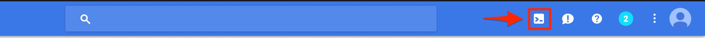

## Toolstack Required

The following toolstack will be required to run the demo:

- Java JDK 8
- [Gradle Build Tool](https://gradle.org/install/)
- [Google Cloud SDK and CLI](https://cloud.google.com/sdk/downloads)

Optional, for the convinience python scripts provided:

- Python 2.7
- Python google-cloud library

## Google Cloud Console Shell

If Google Cloud CLI can not be installed locally (we all know the corporate world!), it is possible to use  [Google Cloud Console Shell](https://cloud.google.com/shell/docs/quickstart#start_cloud_shell) - linux enviornment accessible through a browser.

Just click on the cloud shell icon in the top right corner of the Console UI:



The shell will have almost everything necessary to run the demo - with the exception of the latest Gradle version, but that can be fixed - see below.

## Gradle Setup

The project is managed by Gradle build tool.

The easiest way to install Gradle is via SDK Man. This will install SDK man, install and enable the latest version of Gradle.

**OBS!** It is critical to setup the latest version of Gradle if running the demo via the Google Cloud Shell. The gradle provided out of the box is too old to the build the project. 

```bash
cd ~
curl -s "https://get.sdkman.io" | bash
source ~/.sdkman/bin/sdkman-init.sh
sdk install gradle 4.3.1
source ~/.sdkman/bin/sdkman-init.sh
```

## Source Code

Check out the source code:

```bash
cd ~
git clone https://github.com/evmin/camel-kubernetes-demo.git
```

## Project Gradle Wrapper

And setup the Gradle Wrapper:

```bash
cd camel-kubernetes-demo/gke-camel-template
gradle wrapper
```

